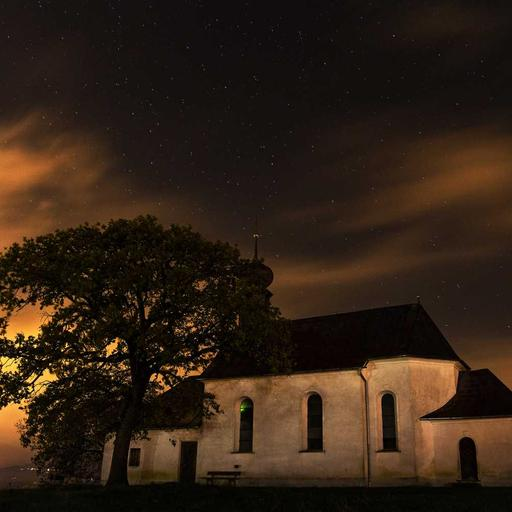
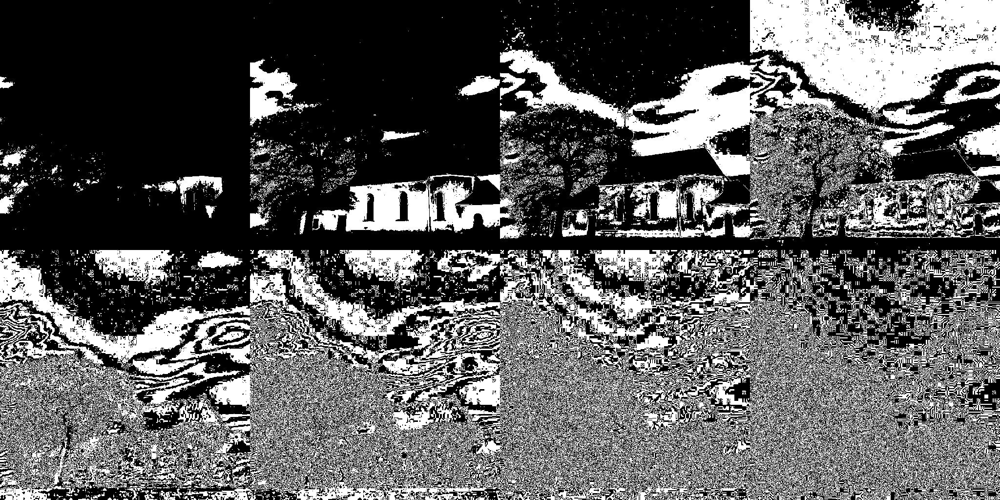
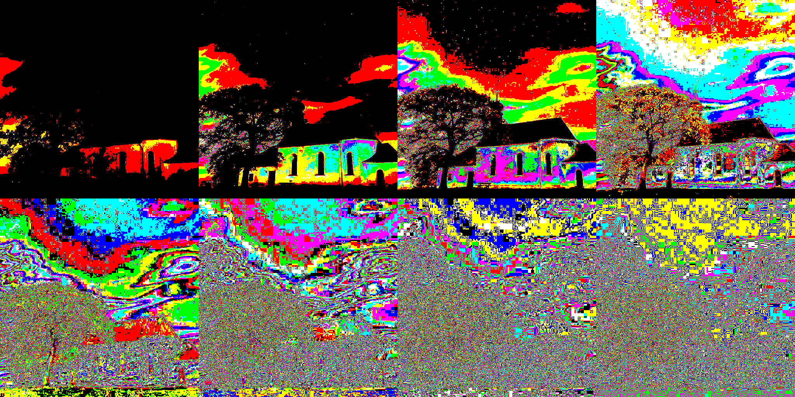

<h1 align="center">Bit-Plane Slicing 🖼️✂️</h1>

<p align="center">
  <em>A desktop application that decomposes an image into its eight binary bit planes.</em>
</p>

---

## 📌 Project Overview
Bit-plane slicing is a method of representing an image with one or more bits of the byte used for each pixel. This project includes two variants:
- **Grayscale Bit-Plane Slicing**: Displays the bit planes from a grayscale image.
- **RGB/Color Bit-Plane Slicing**: Extracts the selected bit plane from each RGB channel and combines them into a striking color result.

### 🗂️ Project Variants

| File | Variant | Use case |
| --- | --- | --- |
| `Bit_plane_slicing.py` | Grayscale | Best for analyzing luminance and standard intensity bits. |
| `Bit_plane_slicing_RGB.py` | RGB / Color | Best for visually exploring color channel contributions bit by bit. |

---

## ✨ Features
- **Broad Format Support**: Load common image formats like JPG, PNG, BMP, TIFF, and WebP.
- **Dual Implementations**: Choose between Grayscale and RGB/Color processing.
- **Interactive Preview**: Use a slider to seamlessly select and preview any bit plane from 0 (Least Significant Bit) to 7 (Most Significant Bit).
- **All-in-One Viewer**: View a beautifully arranged grid of all eight bit planes at once.
- **Export Options**: Save individual planes or export the complete 8-plane output sheet.

---

## 🚀 Getting Started

### 📋 Requirements
- Python 3.9 or newer
- Tkinter (included with standard Python installers on Windows/macOS)
- Pillow (PIL)
- NumPy

### ⚙️ Installation
1. Clone the repository and navigate to the folder:
   ```bash
   cd Bit_plane_slicing
   ```
2. Create and activate a virtual environment (optional but recommended):
   ```bash
   python -m venv .venv
   # Windows PowerShell:
   .venv\Scripts\Activate.ps1
   # Linux/macOS:
   source .venv/bin/activate
   ```
3. Install the dependencies:
   ```bash
   python -m pip install -r requirements.txt
   ```

### 🎮 Running the Application
Run the **Grayscale** version:
```bash
python Bit_plane_slicing.py
```
Run the **RGB/Color** version:
```bash
python Bit_plane_slicing_RGB.py
```

---

## 📊 Output Results

Below are the examples of bit-plane slicing applied to our sample input image. Note how higher bit planes (e.g., Plane 7) retain the most structural information, while lower planes represent fine details and noise.

### 🖼️ Original Input


### 🔲 Grayscale Bit-Plane Slicing (All 8 Planes)
*Bit Plane 7 (MSB) to Bit Plane 0 (LSB)*


### 🎨 RGB Bit-Plane Slicing (All 8 Planes)
*Bit Plane 7 (MSB) to Bit Plane 0 (LSB)*


---

## 🧠 The Algorithm
For the **grayscale version**, the $k^{th}$ bit plane of a pixel value $p$ is mathematically isolated using bitwise shifts and masks:
```text
plane(k) = ((p >> k) & 1) * 255
```
This produces a stark black-and-white image for each $k \in \{0, 1, ..., 7\}$.

For the **RGB version**, this exact operation is mapped independently to the Red, Green, and Blue channels. The three extracted boolean planes are then combined back into an RGB tuple, producing vibrant, stylized color variations!
