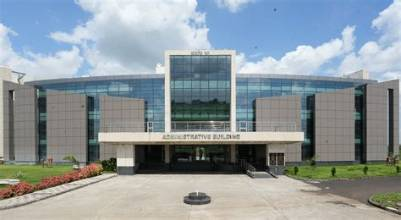
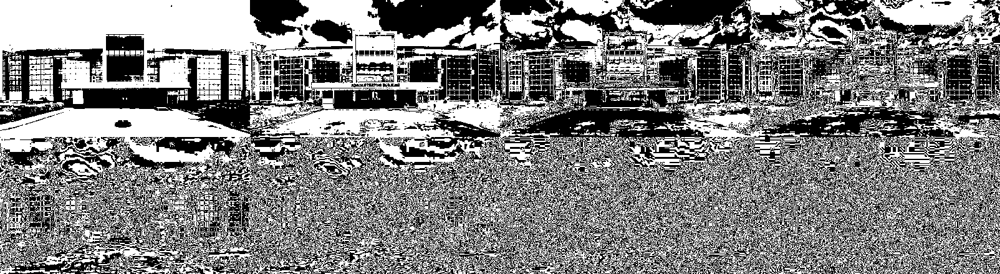
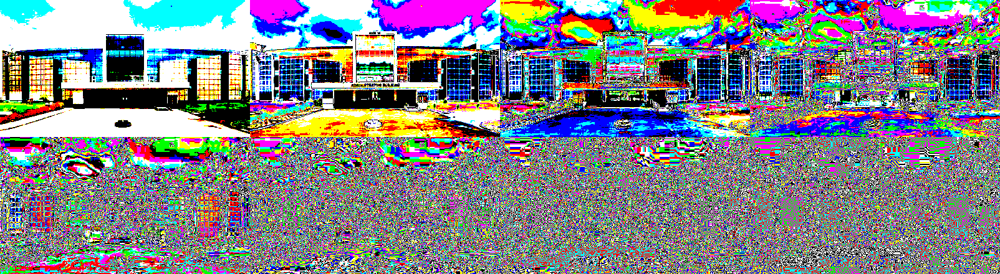

<h1 align="center">Bit-Plane Slicing 🖼️✂️</h1>

<p align="center">
  <em>A desktop application that decomposes an image into its eight binary bit planes.</em>
</p>

---

## 📌 Project Overview
Bit-plane slicing is a method of representing an image with one or more bits of the byte used for each pixel. This project includes two variants:
- **Grayscale Bit-Plane Slicing**: Displays the bit planes from a grayscale image.
- **RGB/Color Bit-Plane Slicing**: Extracts the selected bit plane from each RGB channel and combines them into a striking color result.

### 🗂️ Project Variants

| File | Variant | Use case |
| --- | --- | --- |
| `Bit_plane_slicing.py` | Grayscale | Best for analyzing luminance and standard intensity bits. |
| `Bit_plane_slicing_RGB.py` | RGB / Color | Best for visually exploring color channel contributions bit by bit. |

---

## 🚀 Getting Started

### 📋 Requirements
- Python 3.9 or newer
- Tkinter (included with standard Python installers on Windows/macOS)
- Pillow (PIL)
- NumPy

### ⚙️ Installation
1. Clone the repository and navigate to the folder:
   ```bash
   cd Bit_plane_slicing
   ```
2. Create and activate a virtual environment:
   ```bash
   python -m venv .venv
   .venv\Scripts\Activate.ps1
   ```
3. Install the dependencies:
   ```bash
   python -m pip install -r requirements.txt
   ```

### 🎮 Running the Application
Run the **Grayscale** version:
```bash
python Bit_plane_slicing.py
```
Run the **RGB/Color** version:
```bash
python Bit_plane_slicing_RGB.py
```

---

## 📊 Output Results

Below are the examples of bit-plane slicing applied to our sample input images. Note how higher bit planes (e.g., Plane 7) retain the most structural information, while lower planes represent fine details and noise.

### 🖼️ Example 1: Sample Image


**Grayscale Bit-Plane Slicing (All 8 Planes)**


**RGB Bit-Plane Slicing (All 8 Planes)**


### 🖼️ Example 2: Building Image


**Grayscale Bit-Plane Slicing (All 8 Planes)**


**RGB Bit-Plane Slicing (All 8 Planes)**


---

## 🧠 The Algorithm & Technical Details

**Technical Terms**:
- **Bitwise Operations**: Computations performed directly on the binary representations of pixel values (e.g., shifts `>>` and AND masks `&`).
- **Most Significant Bit (MSB)**: The bit representing the largest value (Bit 7), which holds the majority of the visual structure.
- **Least Significant Bit (LSB)**: The bit representing the smallest value (Bit 0), mostly containing fine detail and random noise.
- **Pixel Depth**: The number of bits used to represent a pixel's color or intensity (8 bits per channel here).
- **Grayscale Conversion**: Transforming an image to represent only intensity levels (luminance), ignoring color.

**Algorithm**:
For the **grayscale version**, the $k^{th}$ bit plane of a pixel value $p$ is mathematically isolated using bitwise shifts and masks:
```text
plane(k) = ((p >> k) & 1) * 255
```
This produces a stark black-and-white image for each $k \in \{0, 1, ..., 7\}$. For the **RGB version**, this operation is mapped independently to the Red, Green, and Blue channels.

**Time Complexity**:
- **Time Complexity**: $\mathcal{O}(N)$ where $N$ is the total number of pixels in the image (or $\mathcal{O}(H \times W)$). Extracting a bit plane requires a constant time bitwise operation for every pixel.
- **Space Complexity**: $\mathcal{O}(N)$ to store the extracted bit planes and final mosaics in memory.
