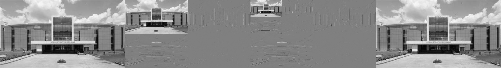

# Manual 2D Haar Discrete Wavelet Transform

A first-principles NumPy implementation of the 2D Haar Discrete Wavelet Transform (DWT) and inverse transform (IDWT). It produces one- and two-level decompositions, reconstructs the image, and verifies the reconstruction error.

## Features

- Greyscale conversion and manual LL, LH, HL, HH subband calculation (no PyWavelets or SciPy)
- Two-level decomposition of the LL approximation subband
- Exact IDWT reconstruction check using mean squared error (MSE)
- Tkinter desktop interface for selecting an image and previewing every result

## Setup

Requires Python 3.10+ and Tkinter (included with standard Python installations on Windows).

```powershell
cd "Discrete Wavelet Transform"
python -m venv .venv
.venv\Scripts\Activate.ps1
python -m pip install -r requirements.txt
```

## Run

Launch the desktop application:

```powershell
python DWT_GUI.py
```

The command-line version also remains available:

```powershell
python DWT.py --input Input_images\original.jpg
```

## Subbands

| Subband | Meaning |
| --- | --- |
| LL | Approximation (low-pass rows and columns) |
| LH | Horizontal detail |
| HL | Vertical detail |
| HH | Diagonal detail |

Odd image dimensions are edge-padded for decomposition and cropped back after reconstruction.

## Results

### 🖼️ Example 1: Sample Image


#### Complete comparison


### 🖼️ Example 2: Building Image


#### Complete comparison



## 🧠 Technical Details & Algorithm

**Technical Terms**:
- **Low-pass filter (LL)**: Captures the approximate, low-frequency structural details of an image.
- **High-pass filter (LH, HL, HH)**: Captures the high-frequency detail components corresponding to horizontal, vertical, and diagonal edges respectively.
- **Multi-resolution analysis**: Analyzing an image at different scales (e.g., Level 1 vs. Level 2 decomposition).
- **Spatial-frequency localization**: The distinct advantage of wavelets where data is localized in both pixel space and frequency domains.
- **Subband coding**: Breaking a signal into different frequency bands and encoding each independently.
- **Mean Squared Error (MSE)**: An evaluation metric to ensure the reconstructed Inverse DWT matches the original image flawlessly.
- **Orthonormal basis**: Mathematical vectors that are both orthogonal and of unit length, central to transforming data cleanly in DWT.

**Time Complexity**:
- **Time Complexity**: $\mathcal{O}(N)$ where $N$ is the total number of pixels in the image (or $\mathcal{O}(H \times W)$). Each row and column operation processes the matrix linearly.
- **Space Complexity**: $\mathcal{O}(N)$ since the LL, LH, HL, and HH subbands collectively require the same amount of memory as the input image, maintaining memory efficiency.

## Project layout

```text
Discrete Wavelet Transform/
|-- DWT.py
|-- DWT_GUI.py
|-- Input_images/
|-- Output/
|-- requirements.txt
`-- README.md
```
