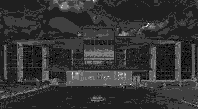
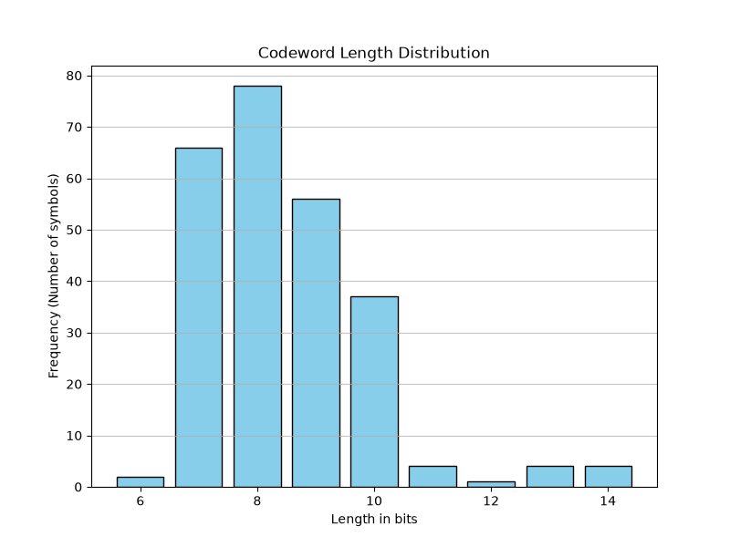
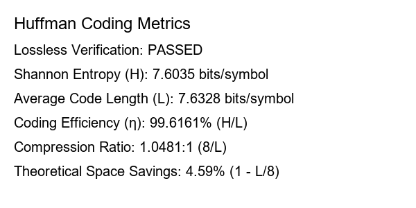

# Manual Huffman Coding for Images

A first-principles Digital Image Processing implementation of Huffman source coding. It derives symbol probabilities from a greyscale image, builds an optimal binary tree using a min-heap, encodes/decodes the pixels, and verifies lossless reconstruction.

## Features

- Manual Huffman tree, prefix-code generation, encoding, and decoding
- Shannon entropy, average code length, coding efficiency, compression ratio, and theoretical space savings
- Tkinter desktop interface with result previews
- No compression or image-processing libraries beyond NumPy/Pillow/Matplotlib

## Setup and run

```powershell
cd Huffman_coding
python -m venv .venv
.venv\Scripts\Activate.ps1
python -m pip install -r requirements.txt
python huffman_gui.py
```

Choose an image, select **Encode with Huffman**, and view the five saved outputs. Command-line usage is also available:

```powershell
python huffman_coding.py path\to\image.jpg
```

## Example output

| Greyscale source | Losslessly decoded image |
| --- | --- |
|  |  |

| Bit-length spatial map | Codeword-length distribution |
| --- | --- |
|  |  |

### Compression metrics



## Technical Details

- **Shannon Entropy ($H$)**: A theoretical lower bound for the average number of bits required to encode the symbols (pixels).
- **Average Code Length ($L$)**: The actual average number of bits used per pixel in this Huffman encoding.
- **Coding Efficiency ($\eta$)**: The ratio of entropy to average code length ($H / L$). 
- **Min-Heap**: An optimized priority queue data structure used in this project to greedily construct the optimal Huffman tree from pixel probabilities.
- **Prefix Code**: The generated Huffman codes are prefix-free (no code is a prefix of another), which guarantees instantaneous, unambiguous decoding.
- **Lossless Compression**: Reconstructing the image bits from the Huffman tree perfectly restores the original image without a single altered pixel.

**Complexity Analysis**:
- **Time Complexity**: 
  - Probability generation: $\mathcal{O}(N)$ where $N$ is the number of pixels.
  - Tree construction: $\mathcal{O}(K \log K)$ where $K \le 256$ is the number of unique pixel intensities.
  - Encoding/Decoding: $\mathcal{O}(N)$. 
  - **Overall Time Complexity**: $\mathcal{O}(N)$.
- **Space Complexity**: $\mathcal{O}(N)$ for image storage and serialized bitstream.

## Project layout

```text
Huffman_coding/
|-- huffman_coding.py
|-- huffman_gui.py
|-- Input_images/
|-- Output/
|-- requirements.txt
`-- README.md
```
