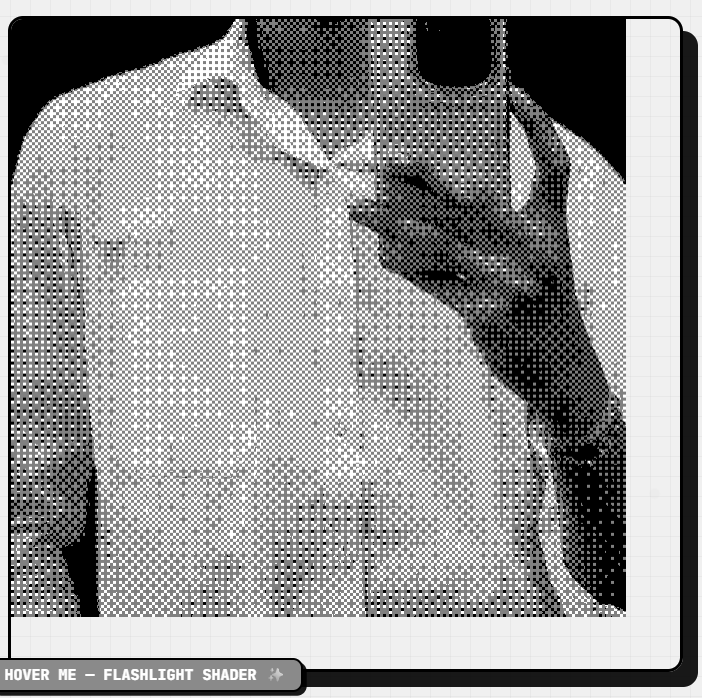
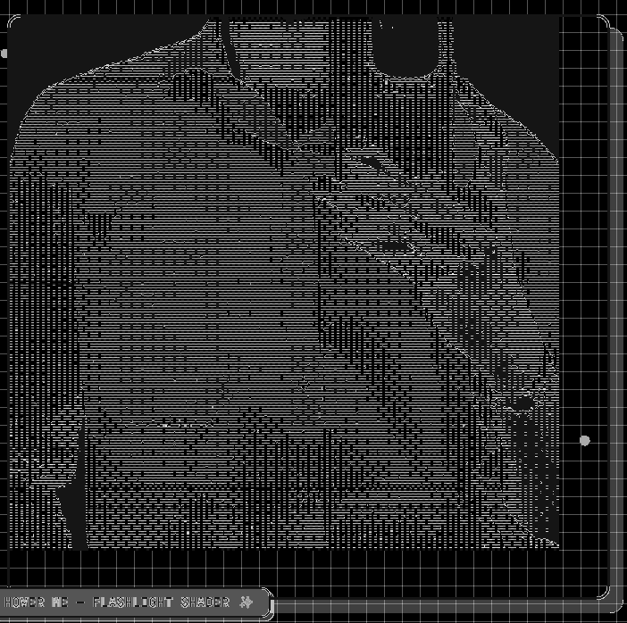
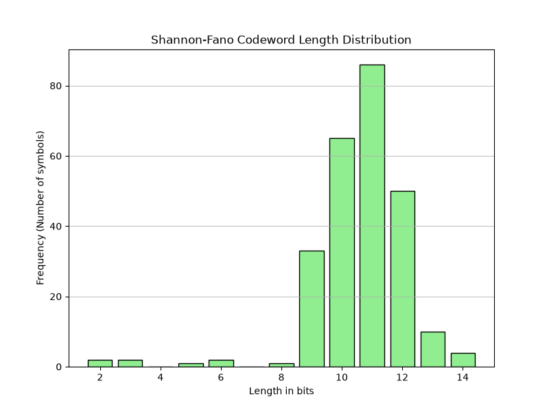
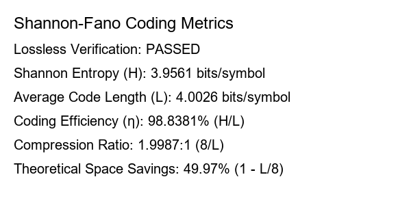

# Manual Shannon-Fano Coding for Images

A Digital Image Processing implementation of Shannon-Fano source coding built from first principles. It creates prefix codes by recursively splitting symbols into approximately equal-probability groups, encodes and decodes the image, and verifies lossless reconstruction.

## Features

- Manual Shannon-Fano codebook construction, bitstream encoding, and prefix decoding
- Entropy, average codeword length, efficiency, compression ratio, and space savings
- Tkinter image-picker with output preview gallery
- No compression or image-processing libraries beyond NumPy/Pillow/Matplotlib

## Setup and run

```powershell
cd Shannon_fano_coding
python -m venv .venv
.venv\Scripts\Activate.ps1
python -m pip install -r requirements.txt
python shannon_fano_gui.py
```

Or run from the command line:

```powershell
python shannon_fano_coding.py path\to\image.jpg
```

## Example output

| Greyscale source | Losslessly decoded image |
| --- | --- |
|  |  |

| Bit-length map | Codeword-length distribution |
| --- | --- |
|  |  |

### Compression metrics



## Technical Details

- **Shannon Entropy ($H$)**: A theoretical lower bound for the average number of bits required to encode the symbols (pixels).
- **Average Code Length ($L$)**: The actual average number of bits used per pixel in this Shannon-Fano encoding.
- **Coding Efficiency ($\eta$)**: The ratio of entropy to average code length ($H / L$). 
- **Recursive Splitting**: The hallmark of Shannon-Fano, where symbols are ordered by probability and continuously divided into two halves with roughly equal total probabilities to assign binary prefix codes.
- **Prefix Code**: No generated code is a prefix of any other code, ensuring the concatenated bitstream can be instantaneously decoded without ambiguity.
- **Lossless Compression**: The exact pixel intensity values are faithfully reconstructed from the bitstream without any quantization or information loss.

**Complexity Analysis**:
- **Time Complexity**: 
  - Sorting probabilities: $\mathcal{O}(K \log K)$ where $K \le 256$.
  - Tree construction (splitting): In the worst case, depth is $\mathcal{O}(K)$, giving $\mathcal{O}(K^2)$ overall split time (since $K$ is small, this is effectively $\mathcal{O}(1)$).
  - Encoding/Decoding: $\mathcal{O}(N)$ where $N$ is the number of pixels.
  - **Overall Time Complexity**: $\mathcal{O}(N)$ dominated by encoding/decoding loops.
- **Space Complexity**: $\mathcal{O}(N)$ for image and bitstream storage in memory.

## Project layout

```text
Shannon_fano_coding/
|-- shannon_fano_coding.py
|-- shannon_fano_gui.py
|-- Input_images/
|-- Output/
|-- requirements.txt
`-- README.md
```
